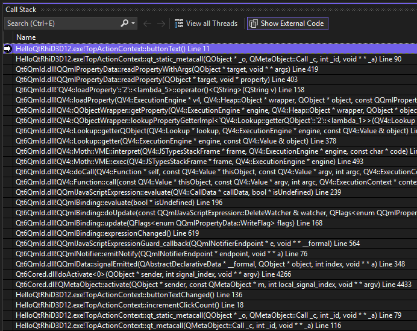
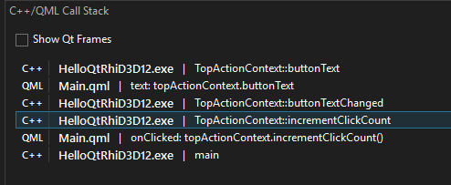

# qml-dbg-tools

PoC visual studio extension to test if it is possible to create a utility that helps me debug Qt/QML applications.

I always found it tedious to find parts of the stack trace that has sourceLocation to be able to connect back where the code currently is.

## The problem

## Features

- Grabs the QML line resolved in the call stack
- Clicking it attempts to navigate the user to the qml file/line
- Hides the QT internal calls for brevity
- Existing Call Stack window is of course unchanged and usable in parallel

## Usage

The extension window is openable by clicking on the Debug > Windows > C++/QML Stack Trace button.
